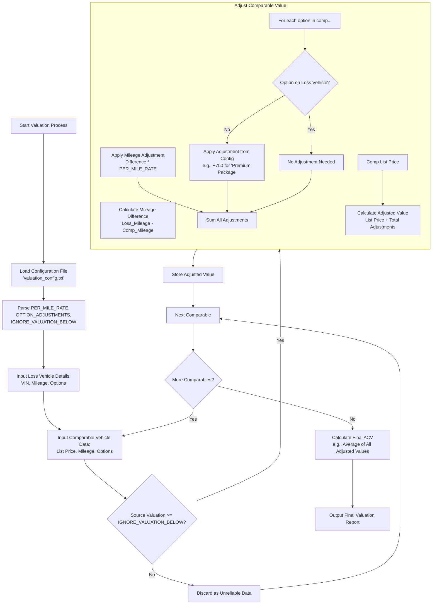

# Automate CCC Reports for Valuation

**DEMONSTRATION ONLY - VISUAL WORKFLOW**

This repository demonstrates the automated valuation system workflow for processing CCC reports and generating accurate market valuations for insurance claims.

## System Workflow



## Key Features

### 1. Smart Comparable Vehicle Sourcing
- **Multi-Source Scraping**: Automatically pulls data from CarFax, Edmunds, Autotrader, Cars.com
- **Built-in Fallbacks**: Continues working even if some sources are unavailable
- **Outlier Detection**: Flags statistical outliers for manual review
- **Damage Detection**: Identifies and flags listings with damage keywords

### 2. Configurable Adjustment Rules
The system uses a simple configuration file (`valuation_config.txt`) that can be easily modified:

```
PER_MILE_RATE=0.12
IGNORE_VALUATION_BELOW=5000
OPTION_ADJUSTMENTS={
    "Premium Package": 750,
    "Navigation System": 500,
    "Sunroof": 300,
    "Leather Seats": 400
}
```

### 3. Automated Processing Pipeline
1. **CCC Report Parsing**: Extracts vehicle details, VIN, mileage, and options
2. **Market Research**: Finds comparable vehicles from multiple sources
3. **Value Adjustments**: Applies mileage and option adjustments automatically
4. **Quality Control**: Filters unreliable data based on configurable thresholds
5. **Report Generation**: Creates professional Word/PDF reports

### 4. Real-World Example
**Case Study: 2007 BMW 335i (45k miles)**
- Insurance valuation: $8,431
- Market comps found: $12,500 - $16,500 range
- Automated adjustments for mileage and options
- Final ACV: Significantly higher than insurance estimate

## Development Timeline

- **Week 1**: CCC report parsing and data extraction
- **Week 2**: Comparable sourcing engine and adjustment logic
- **Week 3**: Report generation and user interface

---

*This is a demonstration repository showing the planned system workflow. The actual implementation will provide a drag-and-drop interface for processing CCC reports and generating market-based valuations.*